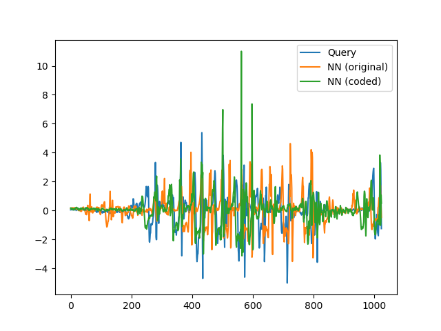
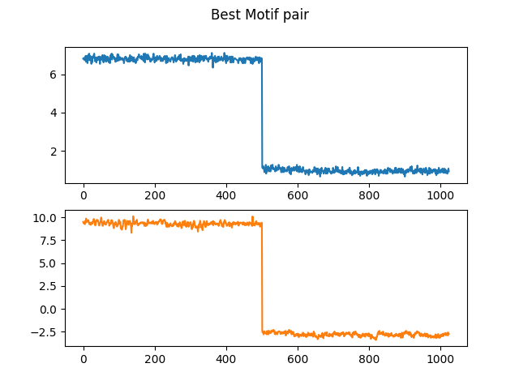
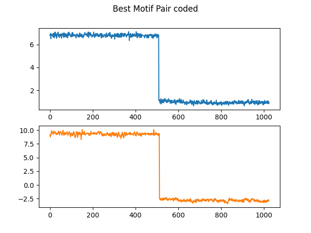

# On Convolutional Autoencoders to Speed Up Similarity-Based Time Series Mining

This repository is the official implementation of [On Convolutional Autoencoders to Speed Up Similarity-Based Time Series Mining](./paper.pdf). It contains code, data and results. Enjoy :smile:

[](https://opensource.org/licenses/MIT)

## Requirements 
To install requirements:

```setup
pip3 install -r requirements.txt
```

If you want to use the pre-trained models to reproduce the results or just see the results, skip to [Evaluation and Results](#evaluation-and-results) section. 

If you want to train the neural network for this work purposes, you will need to download the following datasets. You can still train and evaluate on other datasets, let me know if you do. :wink:

- [Datasets for the pairwise distances experiment](https://drive.google.com/drive/folders/1l9Io9RosXaBf8oR_NLdzqwaFRxMpC_Rm?usp=sharing)
- [Datasets for the similarity search experiment](https://drive.google.com/drive/folders/1wVry8omFpkVlkP4h2D9Jjr86iOTec8KU?usp=sharing)
- [Datasets for the matrix profile experiment](https://drive.google.com/drive/folders/1ckMc5JXjmxXFuK0ghyuR4HepNE6z5ojp?usp=sharing)

Save the datasets in the ./data folder
## Training

To train the convolutional autoencoder in the paper, run these commands:

```bash
cd src/
python3 CAE_1D.py -d <dataset> -e <experiment>
```
The code expects 2 arguments: -d for dataset and -e for experiment (one of pairwise_distances, similarity_search or matrix_profile).
The generated models will be save in the /models/<experiment\>/new_train folder.
Example:
```bash
cd src/
python3 CAE_1D.py -d PigArtPressure -e pairwise_distances
```
Our train example above will train for the AP1 experiment, as shown below.
##### Note: For multiple datasets, use the name of the first one in the table.

The following tables summarizes the datasets used in training and evaluation process for each experiment. 

#### Pairwise distances

| ID | Training                                                |  Evaluation   |  Series Length |
|---- |-------------------                                     | -------------------       |--- |
| AP1 | PigArtPressure + PigAirwayPressure                     | PigCVP                    | 2000
| AP2 | EOGVerticalSignal                                      | EOGHorizontalSignal       | 1250
| AP3 | Mallat + MixedShapesRegularTrain + MixedShapesSmallTrain + Phoneme | StarlightCurves           | 1024
| AP4 |NonInvasiveFetalECGThorax1                              | NonInvasiveFetalECGThorax2| 750
| AP5 | SmallKitchenAppliances + Computers + RefrigerationDevices + LargeKitchenAppliances                                         | ScreenType                | 720
| AP6 | ShapesAll + Herring                                    | Earthquakes               | 512
| AP7 | Herring                                                | ShapesAll                 | 512
| AP8 | Earthquakes + Herring                                  | ShapesAll                 | 512
| AP9 | FordA                                                  | FordB                     | 500
| AP10| UWaveGestureLibraryX + UWaveGestureLibraryY            | UWaveGestureLibraryZ      | 315

##### Note: For the next experiments, the series length will always be 1024 due to the sliding window process.

#### Similarity Search
| ID | Training    | 
|----- |---------- |
| SS1 | FoG        |                     
| SS2 | ZXY-Soccer |                    
| SS3 | PAMAP2     |                
| SS4 | MITDB      |
| SS5 | REFIT      |                        
| SS6 | PPG        |                     

For this experiment, we use queries to perform the subsequence similarity search evaluation.

#### Matrix Profile 
| ID   | Training   | 
|----- |----------  |
| MP1  | Dodgers    |                     
| MP2  | PAMAP2     |                    
| MP3  | ZXY-Soccer |                
| MP4  | mHealth    |

Finally, for this last experiment, we use motif discovery to evaluate the Matrix Profile generated. 

##### Reminder: It is expected that you have already read the [paper](./paper.pdf) to further understanding the training process. 

# Evaluation and Results

##### Note: All the plots are stored in the ./results folder

To evaluate the model, we need the coded datasets. After all, our proposal relies on that. The datasets listed [above](#requirements) have all the coded data ready to use, but if you have trained the model and want to encode the data yourself, you may use this code as shown below:

```bash
python3 encoder.py -d <dataset_name> -e <experiment>
``` 
This code uses the models that you have trained to encode the dataset. In the Similarity Search task, the encoder will encode the queries as well. Either way, save the coded data in ./data/<experiment\>/coded_data folder.

### Pairwise Distances

In order to evaluate the model in this task. Make sure that you are in the ./src directory and run this command:

```bash
python3 pdist.py -d <dataset> -m <model>
```

The dataset is the one that we use for evaluation and the model is the name of dataset used for training, that is, the model generated by training with that dataset. In case of multiple datasets for training, the model is the name of the first one. Example below runs the evaluation of the AP2 experiment.

```bash
python3 pdist.py -d StarlightCurves -m Mallat
``` 

Once you run the command above, the code will calculate all pairwise distances of the original data and the coded data then print the time that it took and plot the distance matrix for both. The following table shows the speedup that we manage to do with this apporach and the Pearson correlation between the distance matrices. 

| ID | Runtime (original) |  Runtime (coded)   |  Speedup |   Pearson   |
|---- |------------------ | ------             | ---------|---          |
| AP1 | 0.05              | 0.04               | 1.19     |0.98         |
| AP2 | 0.17              | 0.06               | 2.65     |0.67         |
| AP3 | 28.03             | 2.72               | 10.30    |0.98         |
| AP4 | 3.21              | 0.39               | 8.33     |    0.91     |
| AP5 | 0.10              | 0.05               | 2.15     |    0.70     |
| AP6 | 0.03              | 0.03               | 0.88     |     0.17    |
| AP7 | 0.18              | 0.06               | 2.84     |    0.88     |
| AP8 | 0.18              | 0.06               | 2.90     |     0.93    |
| AP9 | 2.78              | 0.39               | 7.16     |     0.74    |
| AP10| 1.63              | 0.28               | 5.89     |     0.90    |

The CAE shows a trend that the longer the time needed to calculate the distances between the time series, the greater the advantage of using the autoencoder as a speedup tool. The Pearson correlation values shows that the coded data is pretty much related to the original data, that is, even though the code data is at least 8 times smaller, it is a good representation of the original data, in most cases.

## Similarity Search
First you need to compile the UCR_USP_Suite.cpp code, you can do that by running the make command:
```bash
make
```
Now, you you can just run:
```bash
make <dataset_name>
``` 
That will perform the similarity search with each coded and original query, with the coded and original data, respectively. Basically, we run the similarity search using a original query looking for its nearest neighbor in the original serie, for each query, then we repeat the process for each coded query in the coded data. The following table summarizes the speedup obtained.  

| ID | Runtime (original) |  Runtime (coded)   |  Speedup |
|---- |------------------ | ------             | ---------|
| SS1 | 271.59            | 0.51               | 456.19   |
| SS2 | 4.22              | 0.10               | 42.82    |
| SS3 | 6.40              | 0.32               | 18.68    |
| SS4 | 139.01            | 2.76               | 54.14    |
| SS5 | 77.48             | 4.25               | 18.32    |
| SS6 | 4272.84           | 369.54             | 11.20    |

In this case, the more the coded representation can avoid the DTW calculation, the greater the speedup. Take SS1 for example, for the first query of this dataset, it was necessary to calculate the DTW distance for 58.93% of the substrings. When we search in the reduced time series domain, that value changes to 20.29%. The image below shows an example of how close the NN's (nearest neighbors) are, that is, the reduced representation does a great job and much faster than the original data.  


## Matrix Profile
Finally, to evaluate the last experiment, you need to run the following command:
```bash
python3 mp_znorm_np.npy <dataset_name>
```
This code generates the Matrix Profile (MP) of the original and coded data of the dataset <dataset_name> and shows the time needed to calculate each. Then it will show the Motif value and index for each MP. With this information, we plot these Motifs to see if they look alike, all the plots are available in the results folder. The subsequent table features the speedup achieved in this experiment.

| ID | Runtime (original) |  Runtime (coded)   |  Speedup |
|---- |------------------ | ------             | ---------|
| MP1 | 0.86              | 0.11               |   7.89   |
| MP2 | 261.18            | 3.41               |  76.54   |
| MP3 | 2174.84           | 26.19              |  83.04   |
| MP4 | 18285.62          | 181.26             |  100.88  |

As you can see, the speed up ratio is up to 100. The results of this experiment are really promising because there were cases that the best motif pair are the same for the coded and original data, that is, in such cases, there was no performance loss at all. The two last figures presents one of the cases that it happened (MP2 - PAMAP2). Note that the motif pair is the same in the two images and MP calculation using the coded one was 76.54 times faster.




## Conclusion
We proposed an approach based on convolutional autoencoders, which is orthogonal to state-of-the-art techniques in time series mining. We have shown empirically that the use of CAE consistently improves the efficiency of these methods.Besides, we noticed that the greater the difficulty of these techniques in improving the execution time, the greater our proposal’s benefit. Since the dimensionality reduction can cause distortions inthe obtained results, we also evaluate relative distances’ preservation. In some cases, unfortunately, we notice significant distortions. However, these cases are exceptions and they area ssociated with little data for training and notable differences in complexity between time series.
